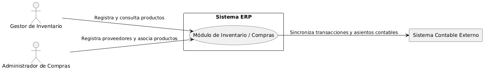
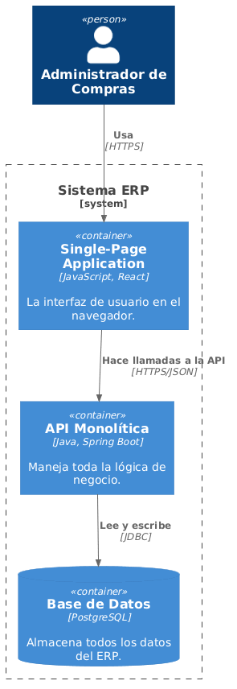
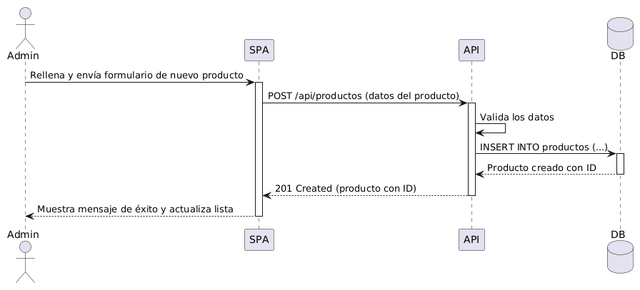
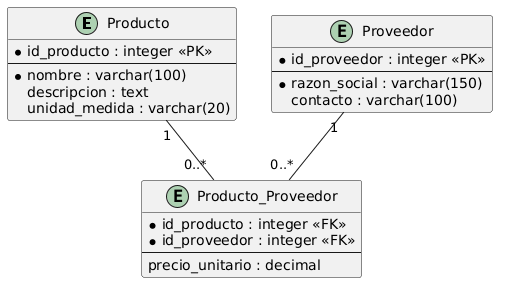

# Arquitectura de Software - Sistema ERP

Este repositorio contiene la documentación de arquitectura para el módulo de inventario y compras del sistema ERP.

---

## 1. Diagrama de Contexto (C1)
Muestra el sistema ERP interactuando con los actores y sistemas externos.

---

## 2. Diagrama de Contenedores (C2)
Muestra la arquitectura interna del sistema (Single-Page Application, API Backend y Base de Datos).

---

## 3. Diagrama de Secuencia
Proceso de registro de nuevos productos por parte del gestor/administrador.

---

## 4. Diagrama Entidad-Relación (MER)
Modelo de datos para Productos, Proveedores y su relación comercial.

